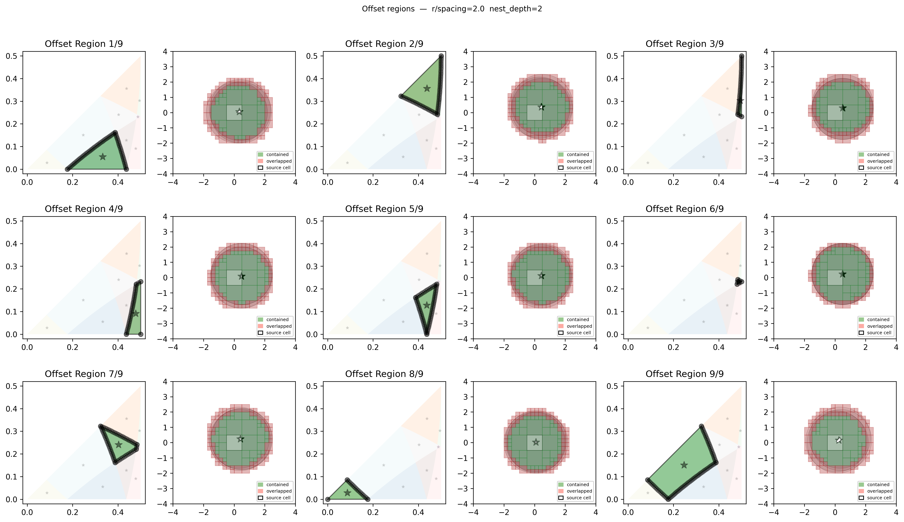
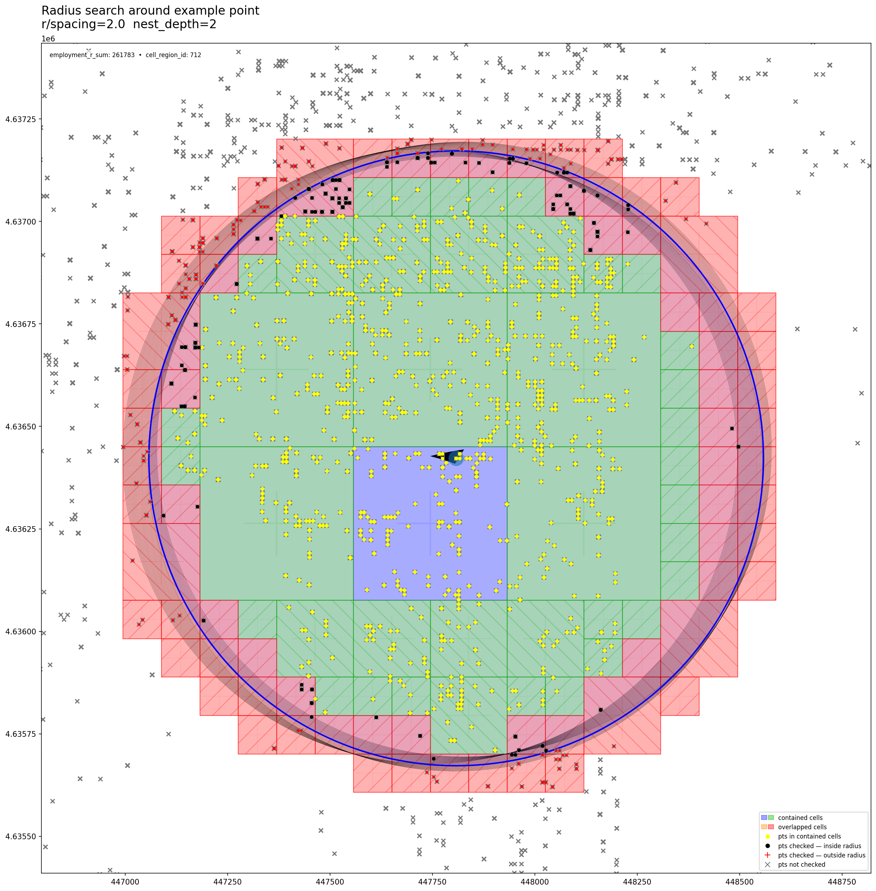

# AABPL-toolkit-python (beta version)
(c) Gabriel M. Ahlfeldt, Thilo N. H. Albers, Kristian Behrens, [Max von Mylius](https://github.com/maximylius), Version 0.1.0, 2024-10


## About
This repository is part of the **[Toolkit of Prime Locations (AABPL)](https://github.com/Ahlfeldt/AABPL-toolkit/blob/main/README.md)**. It contains a Python version of the prime locations delineation algorithm developed by Ahlfeldt, Albers, and Behrens (2024). It is designed to be more readily accessible than the C++/Stata hybrid version used by Ahlfeldt, Albers, and Behrens (2024). The algorithm uses arbitrary spatial point patterns as input and returns a gridded version of the data along with polygons of the delineated spatial clusters as outputs.

Note that while this implementation of the algorithm follows the same basic steps as the one used by Ahlfeldt, Albers, and Behrens (2024), it will not necessarily generate exactly the same results. The Python package is designed to enhance usability. There are subtle differences in the way counterfactual distributions are generated, establishments are assigned to grid cells, clusters are aggregated, and convex hulls are generated. Importantly, the current version of the algorithm samples from a bounding box built around the establishments input into the algorithm, whereas Ahlfeldt, Albers, and Behrens (2024) condition on the presence of employment. Therefore, the parameter values that need to be defined in the program syntax cannot be directly transferred from Ahlfeldt, Albers, and Behrens (2024). 

We recommend that users find their own preferred values depending on the context and purpose of the clustering. We aim to allow for a user-specified sampling area so that users can, akin to Ahlfeldt, Albers, and Behrens (2024), exclude arbitrary areas when generating counterfactual establishment distributions. For replication of the results reported in Ahlfeldt, Albers, and Behrens (2024), we refer to the official replication directory.
 
When using the algorithm in your work, **please cite Ahlfeldt, Albers, Behrens (2024): Prime locations. American Economic Review: Insights, forthcoming.**

## Installation
To install the Python package of the AABPL-toolkit, run the following command in your python environment in your terminal. 

`pip install aabpl`

If you are **new to Python**, you can download the Anaconda distrbution from [this website](https://www.anaconda.com/download). Then enter the command into the Anaconda Promt.

Alternatively you can also install it from within your python script:
```python
import subprocess, sys
subprocess.check_call([sys.executable, "-m", "pip", "install", 'aabpl'])
```
If you use the ready-to-use file described below, the package will install automatically.

<details>
<summary>In case an error occurs at the installation...</summary>

with an erorr message like 'metadata-generation-failed', it is likely caused by incompatabile versions of `setuptools` and `packaging`. 
This can be fixed by upgrading `setuptools` and `packaging` to compatible versions:
```console
pip install --upgrade setuptools>=74.1.1
pip install --upgrade packaging>=22.0
```
Or by downgrading `setuptools`:
```console
pip install --upgrade setuptools==70.0.0
```

</details>


## Usage
You may then load the package by running:
```python
import aabpl
```
Or if you prefer alternatively import the function and testdata explicitly:
```python
# imports 
from pandas import read_csv
from aabpl import (
    radius_search, radius_sum, radius_count, radius_mean,
    detect_cluster_pts, detect_cluster_cells
)
```

### Program syntax

Explain the syntax with its arguments here

### Examples
#### Example 1:
path_to_your_csv = 'input_data/hist_New_York.txt'
crs_of_your_csv =  "EPSG:4326"
pts = read_csv(path_to_your_csv, sep=",", header=None)
pts.columns = ["eid", "employment", "industry", "lat","lon","moved"]

grid = detect_cluster_cells(
    pts=pts,
    crs=crs_of_your_csv,
    r=750,
    c='employment', # Name of the column or list of columns for which values shall be aggregated within search radius 
    exclude_pt_itself=True, # False
    sample_area='buff_cells_min_pts', # 'concave', 'convex', 'buffer', 'bounding_box', 'grid' or None
    min_pts_to_sample_cell=1, # 0, 10
    weight_valid_area=None, # 'estimate', 'precise'
    k_th_percentile=99.5,
    n_random_points=100000,
    random_seed=0,
    queen_contingency=1, # 0, 2
    centroid_dist_threshold=2500,
    border_dist_threshold=1000,
    min_cluster_share_after_contingency=0.05,
    spacing=250, # sets the cell width and height, if None defaults to r/3 
    make_convex=True, # False
)

## Save DataFrames with radius sums and clusters
# Using all the save options below is most likely excessive. 
# saving the shapefile for save_cell_clusters and save_sparse_grid is most
# likely sufficient

# save files as needed
# save only only clusters including their geometry, aggregate values, area and id
df_clusters = grid.save_cell_clusters(filename=output_gis_folder+'clusters', file_format='shp')
df_clusters = grid.save_cell_clusters(filename=output_data_folder+'clusters', file_format='csv')

# save sparse grid including cells only those cells that at least contain one point
df_sparse_grid = grid.save_sparse_grid(filename=output_gis_folder+'sparse_grid', file_format='shp')
df_sparse_grid = grid.save_sparse_grid(filename=output_data_folder+'sparse_grid', file_format='csv')

# save full grid including cells that have no points in them (through many empty cells this will occuppy unecessary disk space)
# df_full_grid = grid.save_full_grid(filename=output_gis_folder+'full_grid', file_format='shp')
# df_full_grid = grid.save_full_grid(filename=output_data_folder+'full_grid', file_format='csv')

pts.to_csv(output_data_folder+'pts_df_w_clusters.csv')

# CREATE PLOTS
fig = grid.plot.clusters(output_maps_folder+'clusters_employment_750m_995th')
fig = grid.plot.vars(filename=output_maps_folder+'employment_vars')
fig = grid.plot.cluster_pts(filename=output_maps_folder+'employment_cluster_pts')
fig = grid.plot.rand_dist(filename=output_maps_folder+'rand_dist_employment')

# Alternatively if you are only interested in calculating the sums within disk around pts you may use this
grid = radius_sum(
    pts=pts,
    crs=crs_of_your_csv,
    r=750,
    c='employment', # Name of the column or list of columns for which values shall be aggregated within search radius 
    exclude_pt_itself=True
)

```


### Ready-to-use script

If you are new to Python, you may find it useful to execute the [`Example.py`](https://github.com/Ahlfeldt/AABPL-toolkit-python/blob/main/Example.py) (or [`Example.ipynb`](https://github.com/Ahlfeldt/AABPL-toolkit-python/blob/main/Example.ipynb)) script saved in this folder. It will install the package, load the testing data set (we provide on example file in the [`input_data`](https://github.com/Ahlfeldt/AABPL-toolkit-python/tree/main/input_data) subfolder), generate clusters, and save various outputs to your working directory.  It should be straightforward to adapt the script to your data and preferred parameter values. 

You have many options for executing the `Example.py` script. One convenient option is to open the script in Sypder, a development environment that can be launched from the Anaconda Navigator. Spyder will automatically set the working directory to the folder to which you have copied the 'Example.py' file. If you name you name your input file `plants.txt` and save it in an  `input_data` subfolder, you will not have to make any adjustments to the script. For a first trial, we recommend that you just copy the `input_data` (with its content) to the same directory where you save `Example.py` file and then run the script from Spyder.

### Inputs

The **compulsory input** into the algorithm is a file containing spatial point pattern data. In the application by Ahlfeldt, Albers, and Behrens (2024), spatial points are establishments. However, these could also be individuals, buildings, or any other subjects or objects whose location can be referenced by geographic coordinates. The data file should contain geographic coordinates in standard decimal degrees and a variable that defines the importance of a subject or object. In the application by Ahlfeldt, Albers, and Behrens (2024), the importance is represented by the employment of an establishment. However, it could also be the productivity of a worker, the height of a building, or any weight that summarizes the importance of a data point. Of course, equal importance will be reflected by a uniform value.

In case you wish to use the above `Example.py` script without having to make any adjustments (except for setting your root directory), you should create a comma-separated file with exactly the same name and structure as the `plants.txt` file provided in this repository (this is just the renamed `prime_points_weighted_79.txt` file from the [AABPL-toolkit](https://github.com/Ahlfeldt/AABPL-toolkit/blob/main/DATA/GlobalCities/prime_points_weighted.zip)). Note that this exemplary input file **does not include variable names**. It includes variables in the following order (separated by commas):

- **identifier variable**: In our case, this is an establishment identifier. If you do not need this, you can set all values to 1.
- **importance weight**: In our case, this is predicted employment. If you want to use equal weights, you can set all values to 1.
- **category identifier**: In our case, this is the type of establishment (e.g., accounting, consulting, etc.). If you do not care, you can set all values to 1.
- **latitude**: Given in decimal degrees in the standard WGS1984 geographic coordinate system.
- **longitude**: Given in decimal degrees in the standard WGS1984 geographic coordinate system.
- **placebolder for another variable**: You can ignore it.


Variable names will then be assigned by the script. Of course, with some adjustments to the 'Example.py' script, you can also import data sets that already contain variable names. Just make sure that latitudes and longitudes are defined by variables named `lat` and `lon`. You can define the name of the variable representing your importance weights in the program syntax.

For future versions of the package, we aim to allow for a shapefile that defines the sampling area of the counterfactual distribution as an **optional input**. This shapefile must be projected within the WGS1984 geographic coordinate system. Ahlfeldt, Albers, and Behrens (2024) exclude residential and undevelopable areas. Such a shapefile could also restrict the sampling area for counterfactual spatial distributions to inhabitable areas or to areas zoned for the development of tall buildings.

### Outputs

The package will create the a number of folders in your working directory into which the outputs will be saved. File names are those specified in the `Example.py` file (you may choose different names). 

Folder | File  | Description |
|:------------------------|:-----------------------|:----------------------------------------------------------------------------------|
| output_data | `clusters.csv` | CSV file containing information on the final delineated clusters, including geographic coordinates in decimal degrees, a cluster id that corresponds to the rank in the distribution of total mass within the cluster (in our case employment), the number of cells within the cluster, the total area of the cluster (in square meters). You may choose another file name in the 'Example.py' script. |
| output_data | `grid_clusters.csv` | CSV file containing a gridded version of the data set, including groups of clustered grid cells identified by the cluster id, geographic coordinates in decimal degrees, and the total mass in the grid cell (in our case employment). You may choose another file name in the 'Example.py' script.   |
| output_data | `pts_df_w_clusters.csv` | CSV file containing the plants with the input data and, in addition, an identifier for the cluster to which a plant belongs. You may choose another file name in the 'Example.py' script. |
| output_gis | `grid_clusters.*` | Shapefile of the gridded data set including the same information as in  `grid_clusters.csv`. You may choose another file name in the 'Example.py' script. |
| output_gis | `clusters.*` | Shapefile of final output, i.e. aggregated clusters (in our case prime locations) along with the same information as in 'clusters.csv'. You may choose another file name in the 'Example.py' script.  |
| output_maps | `clusters_employment_750m_995th.png` | Map showing the boundaries of the final output, i.e. clusters after aggregation (in our case to prime locations), with the density of the selected importance weight (in our case employment) in the background. You may choose another file name in the 'Example.py' script.  |
| output_maps | `employment_cluster_pts.png` | Map showing the plants and how clustered they are. You may choose another file name in the 'Example.py' script.  |
| output_maps | `rand_dist_employment.png` | Technical output to inform the choice of the p-value. You may choose another file name in the 'Example.py' script.  |

Other outputs can be generated by activating the respective lines (by removing the '#') in the 'Exmaple.py' script.

### Recommendations

The results of the clustering algorithm naturally depend on the chosen parameter values. The recommended baseline parameter values have been tested for areas that in terms of geography coverage conform roughly to a large city. For example, if you obtain establishments as point-pattern data for an area that covers roughly New York City (the New York grid in the Global Cities sample in the Prime Locations research paper), you will likely obtain two prime locations (in Midtown and Wallstreet). If your point-pattern data covers a much larger area (e.g. the state of New York), there will many emty areas that affect the counterfactual distributions. Dense places will be in relative terms denser, and, hence, a greater p-value might be required to obtain the same to two prime locations (else, the algorithm may return many more prime locations). You would also have to use more than 100,000 points to have decent coverage of such a large area.
<!--
## Folder Structure and Files (OUTDATED)

Folder | Name  | Description |
|:------------------------|:-----------------------|:----------------------------------------------------------------------------------|
| aabpl | `main.py` | Contains main functions for user: radius_search and detect_clusters   |
| aabpl | `disk_search.py` | Performs radius search in multiple steps: 
(1): 
    (a) Assigns each point to a grid cell. 
    (b) store pt ids for search target in grid cells and precalucaltes sums per grid cell. 
(2): divides cell into cell regions that define which of the surrounding cells are fully included in search radius and which cell are partly overapped by search radius. It assign each point to such a relative search region avoiding unnecessary checks on cells (through methods from 2d_weak_ordering). 
(3): loops over all search source points sorted based on cell id and cell region and 
    (a) sums precalculated sums of non empty cells that are fully within cell radius (or reuses this sum from last source point if same cells were relevant). 
    (b) retrieves all search target points from partly overlapped cells (or reuses them from last source point if same cell were relevant).
    (c) checks bilateral distance from source point to target points and sums values for target points within search radius |
| aabpl | `grid_class.py` | Mostly implemented. Creates class for Grid  |
| aabpl | `2d_weak_ordering.py` | Complex logic that helps to reduce the number of cells that need to be checked if they overlap with the search radius. Relative to origing cell (0,0) it creates a hierarchical weak ordering for surrounding cells. E.g. cell(1,1) is always closer to any point within cell(0,0) than cell(2,2). But its unclear whether a point within cell(0,0) is closer to cell(1,0) or to cell(0,1) |
| aabpl | `random_distribution.py` | functions to draw random points and optain cutoff value for k-th percentile |
| aabpl | `valid_area.py` | Not implemented yet. Will include functions to allow the user to provide a (in)valid area by either providing a geometry or provide a list of (in)valid of cell ids  |
| aabpl | `distances_to_cell.py` | Includes helper functions to calculate smallest/largest distance from a cell to (1) another cell, (2) to a triangle, (3) to points. Also contains other functions related to cell distance checks. |
| aabpl | `general.py` | Contains small helper functions unrelated to radius search methods |
| aabpl/illustrations | `*.py*` | Contains method for illustrating methods (mainly used for testing but can remain in final version to allow user to illustrate the algorithm) |
| plots | `opt_grid` | Created in first days of project to get a feeling for the importance of the relative size of the grid spacing with respect to the search radius |
| aabpl | `optimal_grid_spacing` | Not fully implemented. Automatically choose optimal grid spacing to execute radius search as fast as possible |
| aabpl | `nested_search` | Not fully implemented. Nesting grid cell improves scaling for vary dense (relative to search radius) point data sets. |
| aabpl/documentation | `docstring.py` | Not implemented yet. Will include repetitive help text for functions |
-->
### Selected Files

Folder | Name  | Description |
|:-------------------|:-------------------------------------|:-------------------------------------------------------------------------|
| [-](https://github.com/Ahlfeldt/ABRSQOL-toolkit) | `AABPL-Codebook.pdf` | **Codebook** laying out the **structure of the deliniation algorithm in pseduo code** |

# References 

Ahlfeldt, Albers, Behrens (2024): Prime locations. American Economic Review: Insights, forthcoming.

---

## Algorithm details

*This section documents the internal mechanics of the algorithm; it is not needed for normal usage.*

### Cluster detection pipeline

`detect_cluster_cells` (and the point-level `detect_cluster_pts`) proceed in four stages, each building on the previous.

#### Stage 1 — Radius aggregation

For every point *i*, `radius_search` computes the sum (or count/mean) of a variable across all other points within a circle of radius *r*:

```
agg_i = Σ_{j: d(i,j) ≤ r, j ≠ i}  value_j
```

This produces one number per point that reflects local concentration — a point with a high aggregate is surrounded by many (or high-valued) neighbours. The grid and offset-region machinery described below is what makes this step fast. Edge effects near the study-area boundary are corrected by weighting each aggregate by the inverse of the fraction of the circle that falls within the valid sampling area.

#### Stage 2 — Null distribution

To decide whether an aggregate is *significantly* elevated, a **null distribution** is built by drawing `n_random_points` uniformly at random from the sample area and running `radius_search` on them with the same radius and source points. The **k-th percentile** of this distribution becomes the cluster threshold `τ`; a point is labelled clustered if `agg_i > τ`. Because the null distribution is drawn fresh each call, its shape automatically accounts for the actual study-area geometry, including irregular boundaries and gaps.

#### Stage 3 — Cell-level delineation

`detect_cluster_cells` aggregates radius sums onto a regular output grid (default cell size `r/3`) and applies the threshold cell-by-cell. Contiguous groups of cells that all exceed the threshold form **raw cluster patches**. Adjacent patches are merged when close enough to represent the same concentration:

- **Queen / rook contiguity** — cells sharing a corner (queen) or an edge (rook) are joined.
- **Centroid-distance merging** — two patches merge if their centroids are within `centroid_dist_threshold` (default `r × 10/3`) and their borders within `border_dist_threshold` (default `r × 4/3`).

Clusters whose total aggregate falls below `min_cluster_share_after_contingency` of the dataset total are dropped. If `make_convex=True` (default), all cells inside each cluster's convex hull are added, filling internal gaps.

#### Stage 4 — Cluster polygons

Each final cluster is dissolved from its constituent cells into a single polygon, available at `grid.clustering` and exportable via `grid.save_cell_clusters`.

```
pts  ──► radius_search ──► agg_i per point
                                │
         n random pts ──► agg_j per random point ──► k-th percentile = τ
                                │
                          agg_i > τ ? ──► cluster_i (point label)
                                │
                     aggregate to output grid cells
                                │
                     contiguous cell patches ──► merge ──► convexify
                                │
                         cluster polygons
```

### Grid and offset regions

The algorithm avoids O(n²) point-by-point distance checks by overlaying a regular grid on the target points and pre-aggregating each variable into cell sums. A radius search then reduces to summing over the grid cells that fall within the search circle — O(cells) rather than O(points).

The central insight is that which neighbouring cells a point's search circle **contains or overlaps depends only on where the point sits within its own cell** — not on its absolute position in space. Two source points in different parts of the map but at the same relative position within their respective cells will always have the same circle–cell neighbourhood topology.

The algorithm exploits this by expressing each source point as a **sub-cell offset** — its displacement `(dx, dy)` from its cell centre. The set of all possible offsets is partitioned into **offset regions**: areas within the cell bounded by the grid lines and the arcs where the search circle crosses cell boundaries, such that every point inside a given region shares exactly the same set of fully-contained and potentially-overlapping neighbouring cells. This partition is precomputed once from the geometry of circle–grid intersections.

At search time, assigning a source point to its offset region requires only a modulo to obtain the sub-cell offset, followed by a region classification against the precomputed arc boundaries. From there, the neighbourhood lookup is a direct table read: the precomputed entry lists which cells are **fully contained** (contributing their full aggregated sum) and which are **boundary cells** (partially overlapping, contributing a fractional weight). No per-point distance checks are needed.


*Each panel shows one offset region (shaded, left) and the corresponding set of fully-contained cells (green) and boundary cells (pink) that apply to all points within that region (right).*

Once a source point's neighbourhood is resolved, the search circle is applied:


*Green cells are fully contained — their pre-aggregated sums are added directly. Orange cells overlap the boundary and require individual distance checks (red crosses = outside radius, black dots = inside). Grey crosses fall in cells entirely outside the circle and are never visited.*

### Adaptive grid spacing

The grid spacing is not fixed — it is chosen automatically relative to the search radius `r`. A coarser grid (large spacing) means fewer cells to traverse but more points per boundary cell; a finer grid means more cells but sparser boundary zones. The algorithm selects the spacing as a dimensionless ratio `r / spacing` from a set of candidates at topology breakpoints — values where the circle–cell intersection pattern changes structurally — and jointly optimises over nest depth using a fitted timing model. The result is a spacing that minimises predicted runtime given the dataset size, point density, and spatial distribution.

### Boundary precision and nest depth

Boundary cells introduce approximation error. The `nest_depth` parameter controls how finely boundary cells are subdivided: at `nest_depth=0` each boundary cell is treated as either fully in or fully out; at `nest_depth=d` each boundary cell is recursively split into a 2^d × 2^d sub-grid and the overlap fraction is computed at that finer resolution. Higher nest depth reduces boundary error at the cost of more sub-cell lookups. This trade-off is also folded into the adaptive spacing selection.

